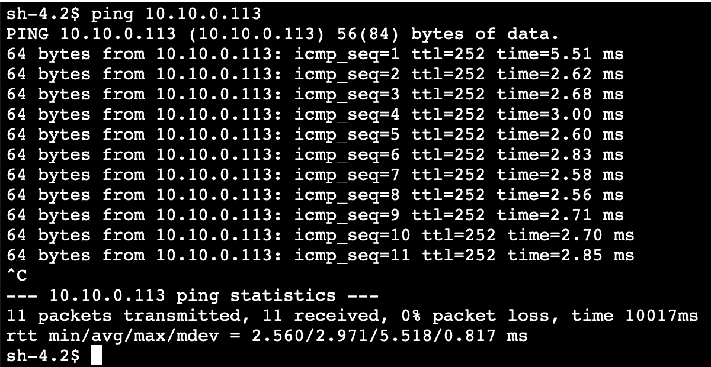

# Blog Simulated site-to-site VPN with AWS CDK

In this blog post, I will show advanced AWS Cloud Development Kit (AWS CDK) capabilities such as Custom Resources to deploy a simulate an AWS site-to-site VPN using strongSwan and two Amazon Virtual Private Cloud (Amazon VPC), optionally you can deploy two Amazon EC2 instances to test ping agains each other. Once you deploy the stack you can use it to test or simulate real scenarios, including migrations, data integration, consuming WEB services and/or databases, among many others.

To favor reusability a AWS CloudFormation stack created by Christopher Kampmeier in this [blog](https://aws.amazon.com/blogs/networking-and-content-delivery/simulating-site-to-site-vpn-customer-gateways-strongswan) is being used to create the customer gateway, please have look if you want to know more about the network aspect of the solution.

AWS CDK allow you to create AWS cloud resources using the expressiveness of the programing language, you can leverage high level constructs, use programing idioms such as conditionals, loops, inheritance, and use the development process and tools that you are familiar with. Moreover AWS CDK uses the power of CloudFormation to perform infrastructure deployments so you can leverage your existing knowledge on CloudFormation.

## Solution Architecture

By default the stack generates the following architecture.


### Cost to test the solution

Resources that may incur costs while you run this experiment include:

* A t3.micro Amazon Linux 2 EC2 instance to host the strongSwan VPN gateway stack.
* An Elastic IP address for the strongSwan VPN gateway.
* An AWS site-to-site VPN connection. See [AWS VPN pricing](https://aws.amazon.com/vpn/pricing/).
* An AWS Transit Gateway with two attachments. See [AWS Transit Gateway pricing](https://aws.amazon.com/transit-gateway/pricing/).
* Optionally two t2.micro Amazon Linux 2 EC2 instances to test the VPN connection.


If you just want to deploy the solution and want to understand the details later on, skip the next section.

## AWS CDK Solution

[AWS CDK](https://docs.aws.amazon.com/cdk/v2/guide/home.html) supports TypeScript, JavaScript, Python, Java, C#/.Net, and Go. Developers can use these programing languages to define Apps which are compose of Stacks and nested stacks witch in turn are compose of reusable components called Constructs.

This solution is written in TypeScript, composed of one App which is organized in two main stacks, four nested stacks and three custom constructs.

|Stack	|Nested-Stack	|File	|Comments	|
|---	|---	|---	|---	|
|VpnSimStack	|	|vpn-sim-stack.ts	|Main Stack that generates all network components	|
|	|NetworkNestedStack	|network-nestedstack.ts	|Generates the Amazon VPCs, Subnets and VPC endpoints for Session Manager.	|
|	|VPNNestedStack	|vpn-nestedstack.ts	|Generates Customer Gateway, Transit Gateway, site-to-site VPN and the Transit Gateway Attachments	|
|	|GatewayNestedStack	|gateway-nestedstack.ts	|Uses constructs to collect site-to-site VPN configuration, create preshared key secrets and create the strongSwan EC2 instance	|
|	|RoutesNestedStack	|routes-nestedstack.ts	|Generate the routing tables to enable communication within Amazon VPCs	|
|ComputeStack	|	|compute-stack.ts	|Optional stack that generates two test EC2 intances, one on the on-premises VPC and one on the cloud VPC	|

|Construct	|File	|Comments	|
|---	|---	|---	|
|GatewayStrongswan	|gateway-strongswan.ts	|Use the CloudFormation template to generate an EC2 instance with strongSwan	|
|VPNConfig	|vpn-config.ts	|Parse and download site-to-site VPN Config for a generic vendor	|
|SimpleInstance	|compute-stack.ts	|Create a t2.micro EC2 instance for testing purposes	|

## CloudFormation Execution Flow

Since ComputeStack is very straightforward, we are going to focus on VpnSimStack, the four nested stack integrated in VpnSimStack have explicit dependencies on each other, so once the CDK code is synthesized and the CloudFormation Template is created, the execution flow that CloudFormation follows is

### NetworkNestedStack

The first nested stack uses [Level 2 construct](https://docs.aws.amazon.com/cdk/v2/guide/cfn_layer.html) to create two Amazon VPCs. 

* One Premises VPC with two subnets
    * 1 Public subnet
    * 1 Private subnet
* Cloud VPC with four subnets
    * 2 Public subnets
    * 2 Private subnets

If no NAT gateway is available (isolated private networks), it also does setup required VPC endpoints for session manager.

### VPNNestedStack

Using Level 1 constructs, the core VPN components are created.

* Transit Gateway.
* Site-to-site VPN.
* Elastic IP for Customer Gateway.
* Transit Gateway Attachments to
    * *Site-to-site VPN.*
    * *Cloud VPC.*

### GatewayNestedStack

This is by far the most complex nested stack in the solution, the solution uses custom resources to execute tasks that are not natively supported by CloudFormation nor CDK.

[Custom Resources](https://docs.aws.amazon.com/cdk/api/v2/docs/aws-cdk-lib.custom_resources-readme.html)allows CloudFormation to manage third-party resources or in this case make a SDK call (`describeVpnConnections`) that does not retrieve an standard json response, allowing the flexibility to run custom code within a lambda and storing the results as attributes in a custom resource (using S3 object metadata).
In the same way AWS Custom Resource, make a SDK call and store the results in custom resource attributes.


Let’s go step by step

1. First a AWS CDK `CustomResource` is created.
    1. Upload a NodeJs 16.X lambda with a dependency on xml2js and a execution role with privileges on `ec2:DescribeVpnConnections`.
    2. The lambda calls `describeVpnConnections`, retrieving the XML field with the configuration, mapping XML to Flatten text format and filter the results by the requested prefixes.
    3. The custom resource is wrapped in a construct that facilitates the traversing of the resulting configurations.
2. Two secrets are created in AWS Secrets Manager to store the pre-shared keys from both tunnels.
3. The strongSwan instance is created using the existing CloudFormation Template, passing as parameters
    1. *Configurations from site-to-site VPN.*
    2. *Secrets with pre-shared keys.*
    3. *Elastic IP for the Customer Gateway.*
4. Finally an AWS Custom Resource is created to get the Primary Elastic Network Interface (ENI) of the strongSwan EC2 instance.

### RouteNestedStack

This nested stack iterates over the route tables related to the private subnets of the Cloud VPC, creates a route to the On Premises VPC’s CIDR through the Transit Gateway. As well as iterates over the route tables related to the private subnets of the On premises VPC, creates a route to the cloud VPC’s CIDR through the gateway’s primary ENI.


## Deploy the stack

### Prerequisites

* Install and setup [AWS CLI](https://aws.amazon.com/cli)
* Install [NodeJS](https://nodejs.org/en/download/)16 or above
* Install [AWS CDK](https://docs.aws.amazon.com/cdk/v2/guide/getting_started.html) CLI

### Deploy stack

1. Clone this repository

unzip file in vpnsim directory

1. download dependencies

```
`cd vpnsim
npm install
cd lib/runtime/describeGatewayConfig
npm install
cd ../../..`
```

1. Deploy stack

```
`cdk deploy VpnSimStack`
```

1. Optinal Deploy test instances

```
cdk deploy ComputeStack
```

### Testing

If you deployed the ComputeStack

1. Open AWS Console and enter ec2 in the top level navigation bar and select EC2 service
2. Select Instances in the left menu
3. Choose the on premises instance & take a note of the private IP
4. Now choose the cloud instance & Take a note of the private IP


1. While selecting the cloud instance, clic Connect on the toolbar, and then go to the session manager tab, and clic on Connect


1. Send a ping to the on premises instance with the private IP from your notes


1. Go back to the instance list in the left menu
2. Choose the on premises instance
3. While selecting the on premises instance, clic on Connect in toolbar, and go to the Session Manager tab, clic on Connect
4. Send a ping to the cloud instance with the private IP from your notes

### Clean Up

if you deploy the Compute Stack

```
cdk destroy ComputeStack
```

This will destroy all main stack and its nestedstack

```
cdk destroy VpnSimStack 
```

## Conclusions

Congratulations! you have a fully working simulated site-to-site VPN, more over all the resources are created automatically by using AWS CDK and CloudFormation, now that you understand an AWS CDK application and its structure, as well as advance features to run custom code using Custom Resources, you can extend this AWS CDK project for your own use cases and as highly suggested next step, [automate the deployment](https://github.com/aws-samples/aws-cdk-deploy-pipeline-using-aws-codepipeline)using AWS Codepipeline.

## License
This project is licensed under the MIT-0 License.
